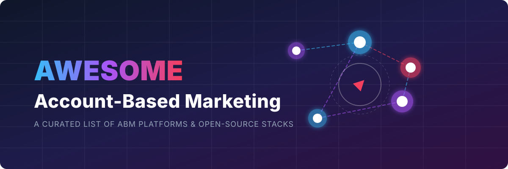

# Awesome Account-Based Marketing (ABM)

  

A curated list of awesome **Account-Based Marketing (ABM)** platforms, open-source GTM software, self-hosted marketing automation tools, B2B data enrichment solutions, and web analytics stacks.

## 🎯 What is Account-Based Marketing?

**Account-Based Marketing (ABM)** is a strategic approach to B2B marketing where marketing and sales teams collaborate to target specific, high-value accounts. ABM platforms help identify target accounts, capture intent signals, enrich data, personalize outreach, orchestrate multi-channel campaigns, and measure account-level engagement and pipeline impact. 

Below is a curated comparison of leading commercial SaaS platforms and open-source equivalents that teams can combine into a self-hosted ABM stack.

## 🏢 SaaS / Hosted Platforms

| Platform | Description | Pricing | Free Tier / Limits | Estimated Company Size (Revenue / Valuation) |
| :--- | :--- | :--- | :--- | :--- |
| **[6sense](https://6sense.com/)** | AI-powered ABM platform focused on predictive account scoring, intent data, and orchestration across advertising and sales. | Custom pricing (estimated $50,000–$300,000+/year) | No free tier | ~$200M ARR / $5.2B Valuation |
| **[Demandbase](https://www.demandbase.com/)** | Enterprise ABM suite with account identification, intent, personalization, and advertising activation. | Custom pricing (starts at ~$18k–$24k/year; median ~$65k/year) | No free tier | >$200M ARR |
| **[Terminus](https://terminus.com/)** | ABM platform emphasizing multi-channel advertising, website personalization, and sales alignment. | Custom pricing (starts at ~$23k/year, up to $250k+/year) | No free tier | ~$63.4M ARR |
| **[RollWorks](https://www.rollworks.com/)** (part of NextRoll) | ABM advertising and account-based advertising platform popular with mid-market teams. | Custom pricing (estimated $13k–$120k+/year) | No free tier | ~$56.2M ARR (NextRoll) |
| **[Metadata](https://www.metadata.io/)** | ABM campaign automation and audience activation platform. | Custom pricing (estimated $20,000–$100,000+/year) | No free tier | ~$15M ARR |
| **[Jabmo](https://jabmo.com/)** | ABM platform specializing in account-based advertising and engagement. | Custom pricing (starts at ~$30,000/year) | No free tier | ~$13.8M ARR |
| **[Factors.ai](https://www.factors.ai/)** | Account intelligence and analytics platform focused on website visitor identification and attribution. | Paid plans start at $199/month (billed annually) | Legacy free plan (limited to 3 user seats, 200 identified companies/month) | ~$10M ARR |
| **[Albacross](https://albacross.com/)** | Website visitor identification and account-based advertising focused especially on European markets. | Paid plans start at €59/month (billed annually) | No free tier (14-day free trial available) | ~$6M ARR |
| **[MadKudu](https://www.madkudu.com/)** | Predictive lead and account scoring platform that feeds into CRM and marketing tools. | Paid plans start at $1,999/month (billed annually) | No free tier (free trial available) | ~$5.8M ARR |
| **[Triblio](https://triblio.com/)** | Account-based orchestration and personalization platform. | Custom pricing (starts at ~$30,000/year) | No free tier | ~$4.2M ARR |

## 🔓 Open-Source Software

- **[Twenty](https://github.com/twentyhq/twenty)**  — Modern open-source CRM (high star count) designed as a Salesforce/HubSpot alternative. Excellent foundation for account and contact management in an ABM stack.
- **[Odoo CRM](https://github.com/odoo/odoo)**  — Part of the broader open-source Odoo suite; useful when you want CRM + marketing + other business apps together.
- **[PostHog](https://github.com/PostHog/posthog)**  — Open-source product analytics platform with web analytics, session replay, feature flags, and data warehouse capabilities. Can power account-level behavioral insights.
- **[Listmonk](https://github.com/knadh/listmonk)**  — Open-source email newsletter and mailing list manager for high-volume or controlled outbound.
- **[Postal](https://github.com/postalserver/postal)**  — A fully featured open source mail delivery platform for incoming & outgoing email.
- **[Matomo](https://github.com/matomo-org/matomo)**  — Privacy-focused open-source web analytics (Google Analytics alternative) useful for tracking target-account website engagement.
- **[Mautic](https://github.com/mautic/mautic)**  — The leading open-source marketing automation platform (GPL). Supports campaigns, lead scoring, segmentation, landing pages, and multichannel messaging. Community and commercial plugins add strong company-centric / ABM capabilities (Company Segments, Company Tags, Company Points, Company Timeline).
- **[SuiteCRM](https://github.com/SuiteCRM/SuiteCRM)**  — Mature, feature-rich open-source CRM (AGPL) with campaigns, target lists, workflows, and strong customization. Frequently used as the system of record for accounts.
- **[EspoCRM](https://github.com/espocrm/espocrm)**  — Flexible open-source CRM with good no-code customization and sales/marketing tools.
- **[OpenOutreach](https://github.com/eracle/OpenOutreach)**  — Open-source AI-powered B2B lead generation and email outreach platform designed for self-hosting.
- **[Laudspeaker](https://github.com/laudspeaker/laudspeaker)**  — Open-source customer engagement and product onboarding platform (visual journey builder, multi-channel messaging). Useful for account nurture and product-led ABM motions (note: check current maintenance status).

### 🛠️ Building a Practical Open-Source ABM Stack
A common approach is to combine:
1. 📣 **Mautic** (or SuiteCRM) for campaigns, scoring, and nurture  
2. 🗃️ **Twenty / SuiteCRM / EspoCRM** as the account/contact system of record  
3. 📈 **PostHog or Matomo** for behavioral and website analytics  
4. 🔌 Open-source or low-cost enrichment + outbound tools for contact data and sequencing  

This stack gives strong control over data and cost while covering core ABM workflows (identify → engage → convert → measure).

---

**🤝 How to contribute**  
Fork this repository, add a new project (with link + short description + category), and open a pull request.  
Prefer actively maintained open-source projects that support account-centric marketing, scoring, campaigns, or related GTM workflows.

**📄 License**  
This list is public domain / CC0. Feel free to copy into your own awesome list or README.

Star the projects you find useful — open-source building blocks for ABM and GTM continue to improve! 🎯🚀
